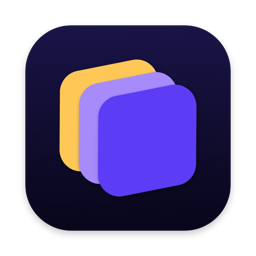
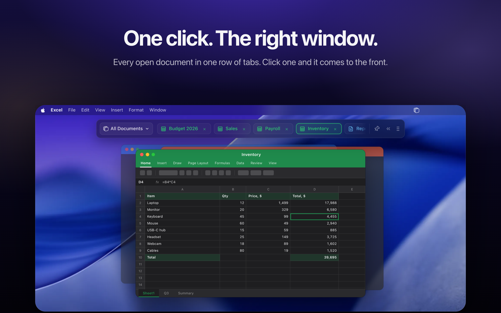

  

<h1 align="center">DocTabs</h1>

  <b>Every Word, Excel and PowerPoint file you have open. One click away.</b> 
  Less finding, more doing. Free for Mac.

  <a href="https://github.com/doctabsapp/DocTabs-releases/releases/latest/download/DocTabs.dmg"><b>⬇ Download for Mac</b></a>

  

---

## Why DocTabs?

Every switch between files costs a few seconds and a little focus. Open the Window menu. Scan the list. Find the window. Do that fifty times a day and it quietly eats your time and energy.

DocTabs puts every open document in one row of tabs. One click, and you're back to work.

- **One click, the right window.** Click a tab and that document comes to the front.
- **Every file, by name.** Two files called *Report*? DocTabs shows their folders, so you open the right one.
- **Where was that saved?** Double-click a tab to show the file in Finder.
- **Focus on one app.** Show just Excel, just Word or just PowerPoint.
- **Pin it.** Keep the bar on screen over any app.
- **Out of the way.** Fold the bar into a small logo whenever you need the space.
- **Speaks your language.** English, German, Spanish, French, Mongolian, Russian, Japanese, Korean and Simplified Chinese.

## Install

1. [Download DocTabs.dmg](https://github.com/doctabsapp/DocTabs-releases/releases/latest/download/DocTabs.dmg)
2. Open it and drag **DocTabs** into **Applications**.
3. Open DocTabs. The first time, macOS may say it can't check the app. Go to **System Settings → Privacy & Security** and click **Open Anyway**.
4. Allow DocTabs to control Word, Excel and PowerPoint when asked. That's how it sees your open files.

**Requires** macOS 13 or later, Apple Silicon or Intel, and Microsoft Word, Excel or PowerPoint.

## Updates

DocTabs keeps itself up to date. You can also choose **Check for Updates…** from its menu bar icon. Every version is listed on the [Releases](https://github.com/doctabsapp/DocTabs-releases/releases) page.

## Your files stay yours

DocTabs reads only the names of your open documents, and only to show them as tabs. It never opens, changes or sends what's inside. No account. No sign-in.

It sends one anonymous "the app is in use today" signal so we know how many people use DocTabs. No file names, no contents, no IP address. You can turn it off in **Settings**.

## Say hi

Found a bug or have an idea? [Open an issue](https://github.com/doctabsapp/DocTabs-releases/issues) or write to [doctabsapp@gmail.com](mailto:doctabsapp@gmail.com). We read everything 💜

[Instagram](https://www.instagram.com/doctabs.app/) · [X](https://x.com/doctabsapp)
