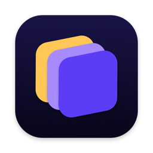
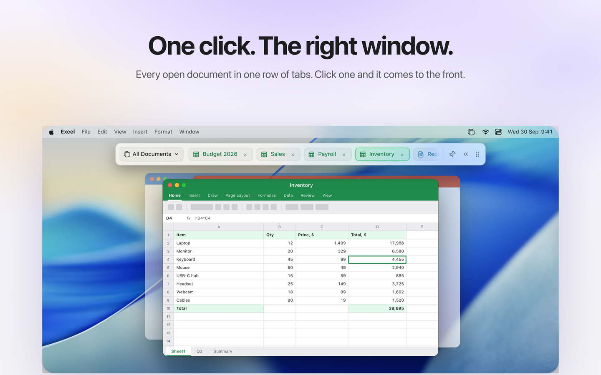

  

<h1 align="center">DocTabs</h1>

  <b>Every open Word, Excel and PowerPoint file. One click away.</b> 
  Tabs for Microsoft Office, on Mac and Windows. Free.

  <a href="https://github.com/doctabsapp/DocTabs-releases/releases/latest/download/DocTabs.dmg"><b>Download for Mac</b></a>
  &nbsp;·&nbsp;
  <a href="https://apps.microsoft.com/detail/9pj1jq22qp0w"><b>Download for Windows</b></a>
  &nbsp;·&nbsp;
  <a href="https://doctabs.app">doctabs.app</a>

<picture>
  <source media="(prefers-color-scheme: dark)" srcset="assets/screenshot-dark.png">
  
</picture>

Every time you switch files, you lose a few seconds and a little focus. Open the Window menu, scan the list, find the window. Do that dozens of times a day and it quietly drains your time and energy. DocTabs puts every open document in one row of tabs, so the file you need is always one click away.

## What you get

- **One click, the right window.** Click a tab and that file comes straight to the front. No menus, no hunting.
- **Every file, by name.** Two files called Report? DocTabs shows which folder each one lives in.
- **There when you need it.** The bar appears with Word, Excel or PowerPoint and steps aside when you switch to another app.
- **All three apps, or one.** See every document in one row, or just your Excel files, with a count for each app.
- **Your order, your way.** Drag tabs into the order that suits your work. Close a file right from its tab.
- **Where was that saved?** Double-click a tab, then click the magnifying glass. Finder or File Explorer opens the folder with your file selected.
- **Pin it and keep it in view.** Pinned, the bar stays on screen over any app, in the color of the Office app you last used.
- **Place it anywhere.** Drag the bar where you like and set its width. If it slips off screen, it glides back.
- **Out of the way in one click.** Fold the bar into a small DocTabs logo, and bring your tabs back with another click.
- **In your language.** English, German, Spanish, French, Mongolian, Russian, Japanese, Korean and Simplified Chinese. It follows your system from the start.
- **Fits right in.** Matches your light or dark look, opens at login if you like, and keeps itself up to date.
- **Free, for good.** No account, no subscription, no in-app purchases.

## Install on Mac

1. [Download DocTabs.dmg](https://github.com/doctabsapp/DocTabs-releases/releases/latest/download/DocTabs.dmg), open it and drag **DocTabs** into **Applications**.
2. Open DocTabs. The first time, macOS may say it can't check the app. Go to **System Settings → Privacy & Security** and click **Open Anyway**.
3. When asked, allow DocTabs to control Word, Excel and PowerPoint. That's how it sees your open files.

The DocTabs icon appears in the menu bar, and the bar shows up whenever Word, Excel or PowerPoint is in front.

## Install on Windows

1. Open [DocTabs on the Microsoft Store](https://apps.microsoft.com/detail/9pj1jq22qp0w) and click **Get**.
2. That's it. DocTabs installs in a few seconds. There are no permissions to allow.

The DocTabs icon appears in the taskbar next to the clock. If you don't see it, click the **^** arrow to show hidden icons.

Step-by-step guide with pictures for both: [doctabs.app/guide](https://doctabs.app/guide/)

## Requirements

| | Mac | Windows |
|---|---|---|
| System | macOS 13 or later | Windows 10 or 11, 64-bit |
| Processor | Apple Silicon or Intel | x64 |
| Office | Word, Excel or PowerPoint for Mac | Word, Excel or PowerPoint desktop app |

## Updates

On Mac, DocTabs checks for new versions on its own and asks before installing one. You can also choose **Check for Updates…** from its menu bar icon. On Windows, the Microsoft Store keeps DocTabs up to date for you. Every version is listed on the [Releases](https://github.com/doctabsapp/DocTabs-releases/releases) page, and what changed is on [doctabs.app/changelog](https://doctabs.app/changelog/).

## Your files stay yours

DocTabs uses only the names and locations of your open documents, and only to show them as tabs. It never opens, changes or sends what's inside. No account, no sign-in.

Once a day it sends an anonymous "in use today" signal so we can count how many people use DocTabs. No file names, no contents, no IP address. You can turn it off in **Settings**. Read the full [Privacy Policy](https://doctabs.app/privacy/).

## Get in touch

Found a bug or have an idea? [Open an issue](https://github.com/doctabsapp/DocTabs-releases/issues) or write to [support@doctabs.app](mailto:support@doctabs.app). We read every message.

Writing about DocTabs? Logos and screenshots are in the [Press Kit](https://doctabs.app/press/).

DocTabs is made by Daymonthyear LLC. It is free, and [donations](https://doctabs.app/donate/) help keep it that way.

[doctabs.app](https://doctabs.app) · [Facebook](https://www.facebook.com/doctabsapp) · [Instagram](https://www.instagram.com/doctabs.app/) · [YouTube](https://www.youtube.com/@doctabsapp) · [X](https://x.com/doctabsapp)

Microsoft, Windows, Word, Excel and PowerPoint are trademarks of Microsoft Corporation. Apple, Mac, macOS and Finder are trademarks of Apple Inc. DocTabs is not affiliated with either company.
